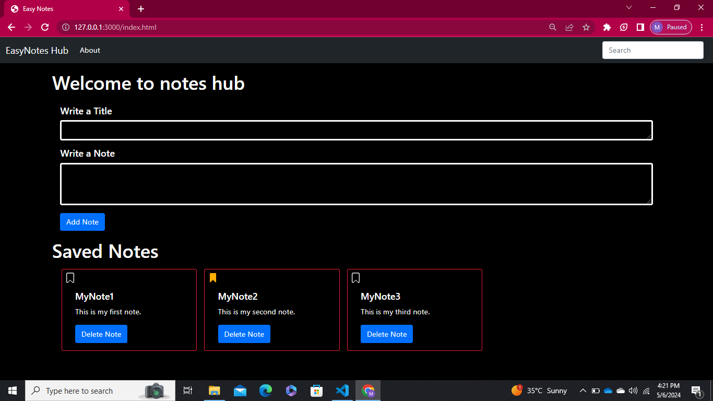

# Easy Notes Hub

Welcome to Easy Notes Hub, your go-to destination for effortless note-taking and organization.

## About

Easy Notes Hub is a simple and intuitive platform designed to streamline your note-taking experience. Whether you're jotting down ideas, storing important information, or studying for exams, Easy Notes Hub makes it easy to add, save, and manage your notes hassle-free.

## Key Features

- **Effortless Note Addition:** Quickly add a title and description to your notes with our user-friendly interface.
- **Powerful Search Capability:** Never lose track of your notes again with our robust search bar.
- **Handy Bookmarking Functionality:** Bookmark your most important or frequently accessed notes with a single click.
- **Convenient Note Deletion:** Easily delete unwanted notes to keep your workspace clutter-free.

## Screenshots

*Caption for Screenshot 1*

*Caption for Screenshot 2*

## Getting Started!!!

To get started with Easy Notes Hub, simply clone the repository to your local machine and follow the installation instructions in the [documentation](docs/installation.md).

## Documentation

For detailed instructions on how to use Easy Notes Hub, please refer to the [documentation](docs/README.md).

## Contributing !!!

We welcome contributions from the community!! If you have any ideas for improvement or would like to report a bug, please open an issue or submit a pull request..

## Gihub Page Link!!!

 https://asadkhan911.github.io/EasyNotesHub-using-javascript/

## License!!

This project is licensed under the [MIT License](LICENSE)..

## Contact 📞

If you have any questions or feedback, feel free to reach out to us at [contact@easynoteshub.com](mailto:asadlinkinpark9@gmail.com).
-------------------------------------------
